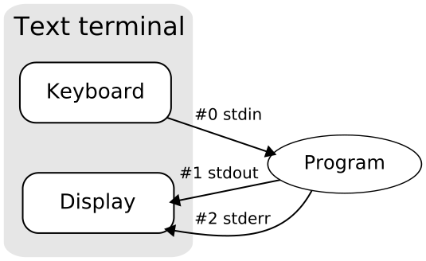

!SLIDE center
# Unix Process Model

!SLIDE bullets incremental
# Applying the Unix Process Model to Web Apps
### - Adam Wiggins

* managed process
* Procfile
* foreman

!SLIDE bullets incremental
# Managed Processes

* we monitor
* we restart
* you scale

!SLIDE 
# Ruby Processes

 
<table style="font-size:2em; margin: 0 auto;">
  <tr style='background: #666'><th style='padding: 0.3em'>Process type</th><th>Command</th></tr>
  <tr><td>web</td><td style='padding-left: 1em; font-family: monospace'>bundle exec rails server</td></tr>
  <tr><td>worker</td><td style='padding-left: 1em; font-family: monospace'>bundle exec rake jobs:work</td></tr>
</table>

!SLIDE 
# Python Processes
 
<table style="font-size:2em; margin: 0 auto;">
  <tr style='background: #666'><th style='padding: 0.3em'>Process type</th><th>Command</th></tr>
  <tr><td>web</td><td style='padding-left: 1em; font-family: monospace'>python manage.py runserver</td></tr>
  <tr><td>worker</td><td style='padding-left: 1em; font-family: monospace'>celeryd --loglevel=INFO</td></tr>
</table>

!SLIDE 
# Clojure Processes
 
<table style="font-size:2em; margin: 0 auto;">
  <tr style='background: #666'><th style='padding: 0.3em'>Process type</th><th>Command</th></tr>
  <tr><td>web</td><td style='padding-left: 1em; font-family: monospace'>lein run -m addon.core</td></tr>
  <tr><td>worker</td><td style='padding-left: 1em; font-family: monospace'>lein run -m addon.worker</td></tr>
</table>

!SLIDE center 
# Processes

!SLIDE 
# Procfile

a format to declare your process types

!SLIDE code smaller

    web:    bundle exec rails server -p $PORT
    worker: bundle exec rake jobs:work
    resque: QUEUE=* bundle exec rake resque:work
    clock:  bundle exec rake resque:schduler

!SLIDE 
# `foreman`

a process manager for local development

!SLIDE commandline 
# `foreman`

    $ gem install foreman

    # run 1 of each process type, and 2 workers
    $ foreman start -c worker=2

    # do not run a clock process
    $ foreman start -c clock=0

!SLIDE center
# Foreman

!SLIDE center
# ~ foreman ~ #

!SLIDE code commandline
# Deploy 
### So easy, we almost forgot this slide!

    $ git push heroku master

    $ git push staging $(branchname):master

!SLIDE 
# Scaling Managed Processes

    > heroku scale web=2 worker=1 resque=2

!SLIDE center 
# Managed Processes

!SLIDE 
# ~ scene ~
