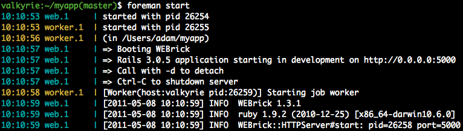
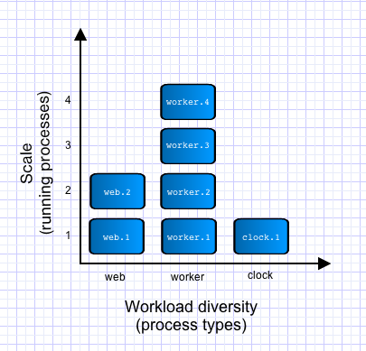

!SLIDE incremental 
# Deploying Rails 3.1 #
# on Heroku Cedar#

!SLIDE 
# About Us

!SLIDE bullets 
# Terence Lee

* Ruby build-pack team
* bundler "core"
* [github.com/hone](http://github.com/hone)
* [@hone02](http://twitter.com/hone02)

!SLIDE bullets 
# Chris Continanza

* Add-Ons team
* patient zero
* [github.com/csquared](http://github.com/csquared)
* [@em_csquared](http://twitter.com/em_csquared)

!SLIDE bullets incremental
# Heroku #

* PaaS (Platform as a Service)
* Deploy with git 
* Scale processes, not servers

!SLIDE center bullets incremental
# Rails 3.1 #

* (asset pipeline)

!SLIDE bullets incremental
# Deploying Rails 3.1 #

* Unix Process Model
* Rails 3.1 Specifics

!SLIDE bullets incremental
# Applying the Unix Process Model to Web Apps
### - Adam Wiggins

* managed process
* Procfile
* foreman

!SLIDE bullets incremental
# Managed Process

!SLIDE 
# Ruby Processes

 
<table style="font-size:2em; margin: 0 auto;">
  <tr style='background: #666'><th style='padding: 0.3em'>Process type</th><th>Command</th></tr>
  <tr><td>web</td><td style='padding-left: 1em; font-family: monospace'>bundle exec rails server</td></tr>
  <tr><td>worker</td><td style='padding-left: 1em; font-family: monospace'>bundle exec rake jobs:work</td></tr>
</table>

!SLIDE 
# Python Processes
 
<table style="font-size:2em; margin: 0 auto;">
  <tr style='background: #666'><th style='padding: 0.3em'>Process type</th><th>Command</th></tr>
  <tr><td>web</td><td style='padding-left: 1em; font-family: monospace'>python manage.py runserver</td></tr>
  <tr><td>worker</td><td style='padding-left: 1em; font-family: monospace'>celeryd --loglevel=INFO</td></tr>
</table>

!SLIDE 
# Clojure Processes
 
<table style="font-size:2em; margin: 0 auto;">
  <tr style='background: #666'><th style='padding: 0.3em'>Process type</th><th>Command</th></tr>
  <tr><td>web</td><td style='padding-left: 1em; font-family: monospace'>lein run -m addon.core</td></tr>
  <tr><td>worker</td><td style='padding-left: 1em; font-family: monospace'>lein run -m addon.worker</td></tr>
</table>

!SLIDE 
# Procfile

a format to declare your process types

!SLIDE
#Procfile

    web:    bundle exec rails server -p $PORT
    worker: bundle exec rake jobs:work
    resque: QUEUE=* bundle exec rake resque:work
    clock:  bundle exec rake resque:schduler

!SLIDE 
# Foreman

a process manager for local development

!SLIDE 
# Foreman

    > gem install foreman
    > foreman start

!SLIDE center
# Foreman

!SLIDE center
# ~ foreman ~ #

!SLIDE code commandline
# Deploy 
### So easy, we almost forgot this slide!

    $ git push heroku master

    $ git push staging $(branchname):master

!SLIDE bullets incremental
# Managed Processes

* we monitor
* we restart
* you scale

!SLIDE 
# Scaling Managed Processes

    > heroku scale web=2 worker=1 resque=2

!SLIDE center 
# Managed Processes

!SLIDE bullets incremental 
# Heroku

* Platform as a Service (PaaS)
